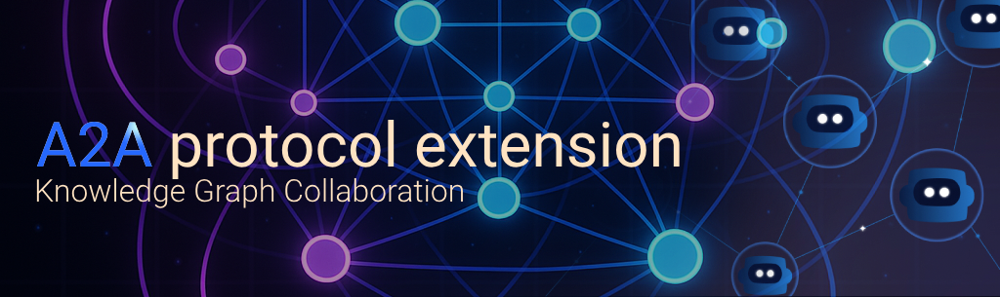
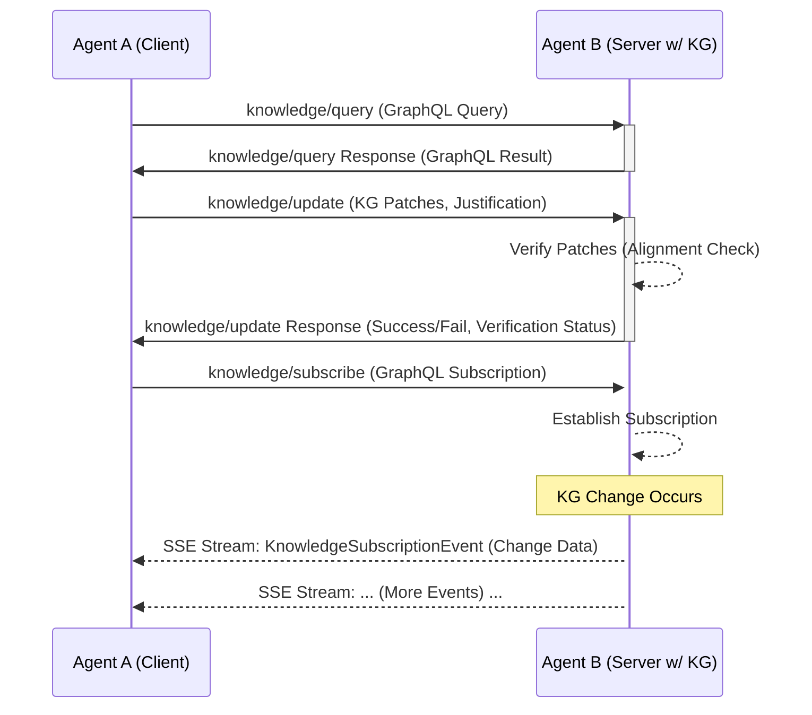

# A2A Protocol Extension: Knowledge Graph Collaboration

**Version:** 1.0 (Draft) 13/04/2025

## Abstract

This document specifies an extension to the Agent-to-Agent (A2A) communication protocol to enable structured knowledge sharing and collaboration between agents using Knowledge Graphs (KGs). Inspired by the need for collaborative knowledge building features across application domains, the extension introduces methods for querying, updating, and subscribing to changes in an agent's symbolic  knowledge base. It standardizes the representation of KG statements and update operations, explicitly supports GraphQL as the primary query language, and incorporates fields for security context, provenance, certainty, and alignment verification, facilitating richer, context-aware, and verifiable multi-agent interactions.

## Motivation

The base A2A protocol primarily focuses on task execution and status updates via message passing. While effective for many interactions, it lacks a standardized mechanism for agents to share, query, and collaboratively build upon complex, structured knowledge about entities, concepts, processes, and their relationships. AI systems aiming for AMI-level capabilities can greatly benefit from a shared understanding and the ability to reason over common knowledge bases.

Knowledge Graphs provide a flexible and powerful paradigm for representing such structured information. This extension aims to:

1.  **Enable Structured Knowledge Exchange:** Provide standard A2A methods for agents to interact with each other's knowledge graphs.
2.  **Facilitate Multi-Agent Collaboration:** Allow agents to contribute to and consume shared knowledge, supporting multi-agent collaboration goals.
3.  **Support Advanced Reasoning:** Provide the foundation for agents to perform co-intuitive reasoning and contextual understanding based on shared knowledge.
4.  **Standardize Querying:** Leverage GraphQL as a widely adopted, powerful, and typed query language suitable for graph structures.
5.  **Integrate Alignment and Compliance Principles:** Incorporate mechanisms for security, alignment verification, provenance tracking, and certainty representation directly into the protocol.
6.  **Promote Interoperability:** Define clear data structures and methods to ensure agents supporting this extension can interact effectively.

## Overview of Extension

This extension introduces:

1.  **New Namespace:** A `knowledge/` method namespace.
2.  **New Methods:**
    *   `knowledge/query`: Query an agent's KG.
    *   `knowledge/update`: Propose changes (add/remove) to an agent's KG.
    *   `knowledge/subscribe`: Subscribe to real-time changes in an agent's KG (via Server-Sent Events).
3.  **New Data Structures:** Standardized Pydantic models (and corresponding JSON schema definitions) for representing KG statements, patches, query/update/subscribe parameters, responses, and events.
4.  **New Agent Capabilities:** Flags in `AgentCapabilities` (`knowledgeGraph`, `knowledgeGraphQueryLanguages`) to advertise support.
5.  **New Error Codes:** Specific JSON-RPC error codes for knowledge-related failures.

## Conceptual Flow

## Detailed Specification

### 1. Agent Capabilities (`AgentCard.capabilities`)

Agents supporting this extension **MUST** advertise it in their Agent Card:

*   `knowledgeGraph` (boolean): Set to `true` if the agent supports the `knowledge/*` methods. Defaults to `false`.
*   `knowledgeGraphQueryLanguages` (array[string]): A list of query languages supported. **MUST** include `"graphql"` if `knowledgeGraph` is `true` and GraphQL is supported. Other languages (e.g., `"sparql"`) may be added in the future.

*(Refer to the updated `a2a.json` schema for the exact structure)*

### 2. Core Knowledge Data Structures

These structures define how knowledge graph information is represented within the A2A protocol.

*   **`KGSubject`**: Represents the subject of a triple.
    *   `id` (string, required): URI or unique identifier.
    *   `type` (string | null): Optional URI of the subject's type.
*   **`KGPredicate`**: Represents the predicate (relationship) of a triple.
    *   `id` (string, required): URI of the predicate.
*   **`KGObject`**: Represents the object of a triple (either a resource or a literal).
    *   `id` (string | null): URI if the object is a resource.
    *   `value` (string | number | boolean | null): Literal value if the object is an attribute.
    *   `type` (string | null): Optional URI of the object's type (if `id` present) or literal datatype URI (e.g., `xsd:string`, if `value` present).
    *   *Constraint:* Must have exactly one of `id` or `value`.
*   **`KGStatement`**: Represents a full RDF-like triple/statement.
    *   `subject` (KGSubject, required)
    *   `predicate` (KGPredicate, required)
    *   `object` (KGObject, required)
    *   `graph` (string | null): Optional named graph URI.
    *   `certainty` (number | null): Optional confidence score [0.0, 1.0].
    *   `provenance` (object | null): Optional metadata about the statement's origin (e.g., `{"sourceAgentId": "agent_xyz", "timestamp": "iso_date"}`).

*(Refer to the updated `a2a.json` schema for the exact structures)*

### 3. Knowledge Update Structures

*   **`PatchOperationType`** (enum): `"add"`, `"remove"`, `"replace"`. (Note: `"replace"` might imply a remove+add sequence).
*   **`KnowledgeGraphPatch`**: Represents a single change operation.
    *   `op` (PatchOperationType, required): The operation type.
    *   `statement` (KGStatement, required): The statement being added, removed, or forming the basis of a replace.

### 4. New JSON-RPC Methods

#### 4.1 `knowledge/query`

*   **Purpose:** Allows an agent to query another agent's knowledge graph.
*   **Request:** `KnowledgeQueryRequest`
    *   `method`: "knowledge/query"
    *   `params`: `KnowledgeQueryParams`
        *   `query` (string, required): The query string (e.g., GraphQL).
        *   `queryLanguage` (string, required, default: "graphql"): Language of the query. Currently only "graphql" is specified.
        *   `variables` (object | null): Variables for the query.
        *   `taskId` (string | null): Optional link to a task.
        *   `sessionId` (string | null): Optional link to a session.
        *   `requiredCertainty` (number | null): Minimum certainty for results.
        *   `maxAgeSeconds` (integer | null): Maximum age of data to consider.
        *   `metadata` (object | null): For embedded security tokens, context, etc.
*   **Response:** `KnowledgeQueryResponse`
    *   `result`: `KnowledgeQueryResponseResult` | null
        *   `data` (object | array | null): The query result data, typically structured as defined by the GraphQL query schema.
        *   `queryMetadata` (object | null): Optional metadata about execution (e.g., sources, time).
    *   `error`: `JSONRPCError` | null (e.g., `KnowledgeQueryError`, `AlignmentViolationError`, `InvalidParamsError`).

#### 4.2 `knowledge/update`

*   **Purpose:** Allows an agent to propose one or more changes (patches) to another agent's knowledge graph. The receiving agent performs verification based on its alignment rules.
*   **Request:** `KnowledgeUpdateRequest`
    *   `method`: "knowledge/update"
    *   `params`: `KnowledgeUpdateParams`
        *   `mutations` (array[KnowledgeGraphPatch], required): List of changes to apply.
        *   `taskId` (string | null): Optional link to a task.
        *   `sessionId` (string | null): Optional link to a session.
        *   `sourceAgentId` (string | null): Identifier of the agent proposing the update.
        *   `justification` (string | null): Textual reason for the update.
        *   `metadata` (object | null): For embedded security tokens, context, etc.
*   **Response:** `KnowledgeUpdateResponse`
    *   `result`: `KnowledgeUpdateResponseResult` | null
        *   `success` (boolean, required): `true` if the update was accepted (at least provisionally), `false` otherwise.
        *   `statementsAffected` (integer | null): Optional count of statements added/removed.
        *   `affectedIds` (array[string] | null): Optional list of URIs/IDs of created/modified entities.
        *   `verificationStatus` (string | null): e.g., "Verified", "Pending Review", "Rejected - Constraint Violation".
        *   `verificationDetails` (string | null): Explanation for the verification status.
    *   `error`: `JSONRPCError` | null (e.g., `KnowledgeUpdateError`, `AlignmentViolationError`, `InvalidParamsError`).

#### 4.3 `knowledge/subscribe`

*   **Purpose:** Allows an agent to subscribe to real-time changes in another agent's knowledge graph that match a specific query. Uses Server-Sent Events (SSE) for streaming.
*   **Request:** `KnowledgeSubscribeRequest`
    *   `method`: "knowledge/subscribe"
    *   `params`: `KnowledgeSubscribeParams`
        *   `subscriptionQuery` (string, required): The subscription query (e.g., GraphQL subscription).
        *   `queryLanguage` (string, required, default: "graphql"): Language of the query.
        *   `variables` (object | null): Variables for the query.
        *   `taskId` (string | null): Optional link to a task.
        *   `sessionId` (string | null): Optional link to a session.
        *   `metadata` (object | null): For embedded security tokens, context, etc.
*   **Response (Streaming):** An SSE stream where each event's `data` field contains a JSON string representing a `KnowledgeSubscriptionEvent` object.
    *   `KnowledgeSubscriptionEvent`: (JSONRPCResponse structure)
        *   `id`: Matches the ID of the original `KnowledgeSubscribeRequest`.
        *   `result`: `KnowledgeGraphChangeEvent` | null
            *   `op` (PatchOperationType): The type of change (`add`, `remove`, `replace`).
            *   `statement` (KGStatement): The statement that changed.
            *   `changeId` (string, uuid): Unique ID for this specific event.
            *   `timestamp` (string, date-time): When the change was confirmed.
            *   `changeMetadata` (object | null): Metadata about the change confirmation.
        *   `error`: `JSONRPCError` | null (Errors can be streamed if the subscription fails mid-stream, e.g., `KnowledgeSubscriptionError`).
    *   *Note:* The initial HTTP response to the POST request should be `200 OK` with `Content-Type: text/event-stream`. Errors related to *establishing* the subscription (e.g., invalid query, not supported) should be returned as a standard JSON-RPC error response with an appropriate HTTP status code (e.g., 400, 501).

### 5. New Error Types

*   **`-32010 KnowledgeQueryError`**: Generic query failure (syntax, execution).
*   **`-32011 KnowledgeUpdateError`**: Update rejected (conflict, constraint violation, permission).
*   **`-32012 KnowledgeSubscriptionError`**: Subscription failed (invalid query, resource issue).
*   **`-32013 AlignmentViolationError`**: Operation explicitly violates alignment rules (can apply to query, update, or subscribe).

*(Refer to the updated `a2a.json` schema for the exact structures)*

## GraphQL Integration

This extension standardizes the *transport* of GraphQL queries, mutations (via patches), and subscriptions over A2A, not the GraphQL schema itself.

*   **Client:** Constructs the GraphQL query/subscription string and variables, placing them in the `query`/`subscriptionQuery` and `variables` fields of the A2A request parameters.
*   **Server:**
    *   Must host a GraphQL endpoint internally or have access to one representing its knowledge graph.
    *   Parses the `query`/`subscriptionQuery` and `variables` from the A2A request.
    *   Executes the GraphQL request against its engine.
    *   For `knowledge/query`, wraps the standard GraphQL JSON response within the `result.data` field of the `KnowledgeQueryResponse`.
    *   For `knowledge/update`, translates the `KnowledgeGraphPatch` operations into appropriate GraphQL mutations or direct KG modifications, performs verification, and returns the `KnowledgeUpdateResponse`.
    *   For `knowledge/subscribe`, establishes the subscription with its GraphQL engine and pushes formatted `KnowledgeSubscriptionEvent` messages over the SSE stream when the engine yields results.
*   **Schema:** Agents may need a mechanism to discover each other's supported GraphQL schemas (e.g., via a separate capability endpoint or a link in the Agent Card), although this is outside the scope of the A2A *protocol message* specification itself.

##  Alignment Integration

This extension directly supports aligned collaboration:

*   **:** The `metadata` field in request parameters allows for passing embedded security tokens or context required by the receiving agent's security layer. Verification steps in `knowledge/update` align with secure state transitions.
*   **Alignment & Core Directives:**
    *   `knowledge/update` responses include `verificationStatus` and `verificationDetails`, reflecting checks against any implemented alignment mechanisms.
    *   `justification` field provides auditable rationale for changes.
    *   Servers can implement alignment checks to filter `knowledge/query` results or reject updates/subscriptions (`AlignmentViolationError`).
*   **Multi-Agent Collaboration:** Provides the standardized methods (`query`, `update`, `subscribe`) needed for agents to share and build upon knowledge collaboratively.
*   **Provenance & Certainty:** `KGStatement` includes optional fields for `provenance` and `certainty`, allowing agents to track data lineage and reliability. `KnowledgeQueryParams` allows filtering by certainty.

## Implementation Considerations

*   **Server (`A2AServer`, `TaskManager`/`KnowledgeManager`):**
    *   Requires handlers for the new `knowledge/*` methods in `A2AServer`.
    *   Needs a dedicated `KnowledgeManager` or extension of `TaskManager` to:
        *   Interface with a KG backend (e.g., RDFLib, GraphDB, Neo4j, Neptune).
        *   Implement or interface with a GraphQL engine (e.g., Ariadne, Graphene, Strawberry GraphQL for Python).
        *   Implement the patch logic for `knowledge/update`.
        *   Implement the subscription logic, potentially using a publish/subscribe mechanism linked to KG changes, and manage SSE connections.
        *   Integrate verification logic against alignment rules for updates and potentially queries/subscriptions.
*   **Client (`A2AClient`):**
    *   Requires new methods (`knowledge_query`, `knowledge_update`, `knowledge_subscribe`).
    *   `knowledge_subscribe` needs to handle the `AsyncIterable[KnowledgeSubscriptionEvent]` stream, similar to `send_task_streaming`.
*   **Error Handling:** Implementations should handle the new specific error codes gracefully.
*   **Capability Checks:** Clients **SHOULD** check `agent_card.capabilities.knowledgeGraph` and `agent_card.capabilities.streaming` (for subscribe) before attempting to use these methods.

This extension significantly enhances the A2A protocol, paving the way for more intelligent, collaborative, and context-aware agent interactions aligned with safety and ethical principles.