# Feature: Add Knowledge Graph Collaboration Extension to A2A Protocol

---

## **Context & Motivation:**

This PR introduces a major extension to the A2A protocol enabling agents to interact with each other's Knowledge Graphs (KGs). Advanced agentic collaboration also requires sharing and querying operational knowledge in a safe and verifiable way. This extension provides standardized methods for KG query, update, and subscription, directly inspired by principles for enhanced reasoning, alignment, and multi-agent understanding. It prominently features support for GraphQL as the primary query language.

---

## Conceptual Flow

---

## **Description of Changes:**

1.  **`common/types.py`:**
    *   Added new Pydantic models: `KGSubject`, `KGPredicate`, `KGObject`, `KGStatement`, `PatchOperationType`, `KnowledgeGraphPatch`.
    *   Added parameter models: `KnowledgeQueryParams`, `KnowledgeUpdateParams`, `KnowledgeSubscribeParams`.
    *   Added request models: `KnowledgeQueryRequest`, `KnowledgeUpdateRequest`, `KnowledgeSubscribeRequest`.
    *   Added response/result models: `KnowledgeQueryResponse`, `KnowledgeQueryResponseResult`, `KnowledgeUpdateResponse`, `KnowledgeUpdateResponseResult`.
    *   Added streaming event models: `KnowledgeGraphChangeEvent`, `KnowledgeSubscriptionEvent`.
    *   Added new error types: `KnowledgeQueryError`, `KnowledgeUpdateError`, `KnowledgeSubscriptionError`, `AlignmentViolationError`.
    *   Updated `A2ARequest` Union type to include new knowledge requests.
    *   Added `knowledgeGraph` and `knowledgeGraphQueryLanguages` to `AgentCapabilities`.

2.  **`a2a.json`:**
    *   Updated JSON schema to include definitions for all new types, requests, responses, errors, and capabilities listed above.
    *   Ensured schema reflects GraphQL support (`queryLanguage` enum, `variables`, flexible `data` structure in response).

3.  **`client.py` (`A2AClient`):**
    *   Added new async methods: `knowledge_query`, `knowledge_update`, `knowledge_subscribe`.
    *   `knowledge_subscribe` returns an `AsyncIterable[KnowledgeSubscriptionEvent]` using SSE.
    *   Added capability checks before calling new methods.

4.  **`server.py` (`A2AServer`):**
    *   Updated `_process_request` to route new `knowledge/*` methods based on `AgentCapabilities`.
    *   Added specific error handling for `MethodNotFoundError` if capabilities are missing.
    *   Updated `A2ARequest` validation usage.
    *   SSE stream generation logic in `_create_response` now handles `KnowledgeSubscriptionEvent` responses.

5.  **`task_manager.py` (`TaskManager`, `InMemoryTaskManager`):**
    *   Added abstract method signatures for `on_knowledge_query`, `on_knowledge_update`, `on_knowledge_subscribe` to the `TaskManager` ABC.
    *   Provided placeholder implementations in `InMemoryTaskManager` that return `UnsupportedOperationError`. *(Note: Real implementation requires KG/GraphQL backend)*.
    *   Added placeholder for `knowledge_sse_subscribers` dictionary.

**Key Features Implemented:**

*   Protocol definition for KG Query, Update, and Subscription methods.
*   Explicit support for GraphQL (`queryLanguage`, `variables`).
*   Standardized data models for KG statements and patches.
*   Incorporation of specialized safety and compliance concepts: `certainty`, `provenance`, `justification`, `verificationStatus`, `metadata` fields.
*   Capability flags (`knowledgeGraph`, `knowledgeGraphQueryLanguages`) in `AgentCard`.
*   Client methods for utilizing the new features.
*   Server routing and basic capability checks for new methods.
*   Updated JSON Schema specification.

**Implementation Notes:**

*   The server-side logic in `InMemoryTaskManager` for handling the actual KG operations and GraphQL execution is **not implemented** in this PR (placeholders returning `UnsupportedOperationError`). A concrete agent implementation will need to provide this using appropriate backend libraries (e.g., RDFLib + Ariadne).
*   Subscription management (tracking subscribers, matching changes to queries) is also part of the backend implementation left for concrete agents.

**Testing:**

*   Added/updated unit tests for new types in `common/types.py`.
*   Added basic unit tests for new `A2AClient` methods (checking request formation).
*   Added basic tests for `A2AServer` routing of new methods (checking capability errors and routing to manager stubs).
*   *TODO:* Integration tests require a mock or real agent implementation with KG/GraphQL capabilities.

**Reviewer Guidance:**

*   Please review the API design of the new methods (`knowledge/*`).
*   Check the correctness and completeness of the new Pydantic types and the JSON schema (`a2a.json`).
*   Verify the client method implementations and server routing logic.

---

# 🚀 Enhancing A2A: Knowledge Graph Collaboration

This document outlines a significant extension to the Agent-to-Agent (A2A) protocol, enabling agents to collaboratively build, query, and react to shared structured knowledge using **Knowledge Graphs (KGs)**.

## The Need for Structured Knowledge

While the base A2A protocol excels at task-based communication, complex AI collaboration requires a deeper, shared understanding of the world – entities, concepts, relationships, and processes. Knowledge Graphs offer a flexible and powerful way to represent this structured information. This extension provides the standard mechanisms for agents to leverage KGs within the A2A framework.

## Core Features

This extension introduces a new `knowledge/` namespace with methods that allow agents to:

1.  ❓ **Query Knowledge (`knowledge/query`)**
    *   Ask questions of another agent's KG using standardized query languages.
    *   **GraphQL First:** Explicit support for **GraphQL** queries and variables.
    *   *Example:* "Find all tasks assigned to 'agent-x' that are currently 'working'."

2.  ✍️ **Update Knowledge (`knowledge/update`)**
    *   Propose additions or removals of specific facts (statements/triples) to another agent's KG.
    *   Includes fields for `justification` and `sourceAgentId` for provenance and auditability.
    *   Receiving agent verifies updates against its internal rules and alignment constraints.
    *   *Example:* "Add the fact that 'task-123' has produced 'artifact-abc'."

3.  🔔 **Subscribe to Knowledge Changes (`knowledge/subscribe`)**
    *   Receive real-time notifications (via Server-Sent Events) when specific parts of an agent's KG change.
    *   Uses **GraphQL Subscriptions** to define the data of interest.
    *   *Example:* "Notify me whenever the status of any task associated with 'project-alpha' changes."

---

## Example Workflow

```mermaid
sequenceDiagram
    title A2A Knowledge Graph Collaboration Example

    participant AgentA as 🧠 Agent A <br/> (Researcher)
    participant AgentB as 📚 Agent B <br/> (KG Custodian/Verifier)
    participant AgentC as 👀 Agent C <br/> (Field Reporter)

    %% --- Phase 1: Querying Existing Knowledge ---
    Note over AgentA: Needs info on ongoing projects
    AgentA ->>+ AgentB: knowledge/query <br/> query: "{ projects(status: \"active\") { id name } }"
    activate AgentB
    Note over AgentB: Processes GraphQL query <br/> Checks Agent A's permissions
    AgentB ->>- AgentA: Response <br/> result: { "data": { "projects": [{"id": "proj-1", "name": "Project Phoenix"}] } }
    deactivate AgentB

    %% --- Phase 2: Adding New Knowledge ---
    Note over AgentC: Observes project completion
    AgentC ->>+ AgentB: knowledge/update <br/> mutations: [ {op: "add", statement: {subj: "proj-1", pred: "hasStatus", obj: "Completed", certainty: 0.95}} ], <br/> justification: "Field observation confirmed completion", sourceAgentId: "AgentC"
    activate AgentB
    Note over AgentB: Verifies update against <br/> Alignment Manifest (e.g., source trust, data consistency)
    AgentB -->> AgentB: Internal KG Update
    AgentB ->>- AgentC: Response <br/> result: { success: true, verificationStatus: "Verified" }
    deactivate AgentB

    %% --- Phase 3: Subscription and Notification ---
    Note left of AgentA: Had previously subscribed to project status changes <br/> via knowledge/subscribe query targeting 'hasStatus' predicate <br/> for projects it has access to.

    activate AgentB
    Note over AgentB: KG change triggers notification <br/> for Agent A's active subscription
    AgentB -->> AgentA: SSE Stream: KnowledgeSubscriptionEvent <br/> result: { op: "add", statement: {subj: "proj-1", pred: "hasStatus", obj: "Completed", certainty: 0.95}, changeId: "uuid-...", timestamp: "..." }
    deactivate AgentB

    %% --- Phase 4: Reacting to New Knowledge ---
    activate AgentA
    Note over AgentA: Processes received update <br/> Decides to fetch final report artifact ID
    AgentA ->>+ AgentB: knowledge/query <br/> query: "{ project(id: \"proj-1\") { finalReport { artifactId } } }"
    activate AgentB
    Note over AgentB: Processes query
    AgentB ->>- AgentA: Response <br/> result: { "data": { "project": { "finalReport": { "artifactId": "artifact-xyz" } } } }
    deactivate AgentB
    deactivate AgentA
    Note over AgentA: Can now use tasks/get to retrieve artifact-xyz
```

---

## Alignment & Compliance

This extension is designed with strong safety and compliance principles in mind:

*   **Cognitive Mapping & Symbolic Reasoning:** Directly supports representing and sharing the symbolic relationships modeled in cognitive maps and latent spaces.
*   **Secure Collaboration:** `metadata` fields allow secure context passing; update verification enforces rules.
*   **Alignment & Auditability:** `provenance`, `certainty`, `justification`, and `verificationStatus` fields support verifiable and aligned AI behavior.
*   **Multi-Agent Reasoning:** Provides the foundation for shared understanding needed for complex collaborative reasoning.

## Benefits

*   **Richer Agent Interaction:** Moves beyond simple tasking to deep knowledge sharing.
*   **Improved Contextual Awareness:** Agents can query for relevant background information.
*   **Enhanced Collaboration:** Enables joint knowledge base construction and maintenance.
*   **Standardization:** Provides a common protocol layer for diverse KG backends and GraphQL engines.
*   **Foundation for Advanced Machine Intelligence:** Supports capabilities like shared understanding, complex reasoning, and verifiable alignment.

---

## Next Steps

- Updating the demo UI code to include a KG-driven workflow.
- Implementing agents will require integrating KG storage (e.g., RDFLib, GraphDB, Neo4j) and a GraphQL engine (e.g., Ariadne, Graphene) into the A2A server implementation.

---
