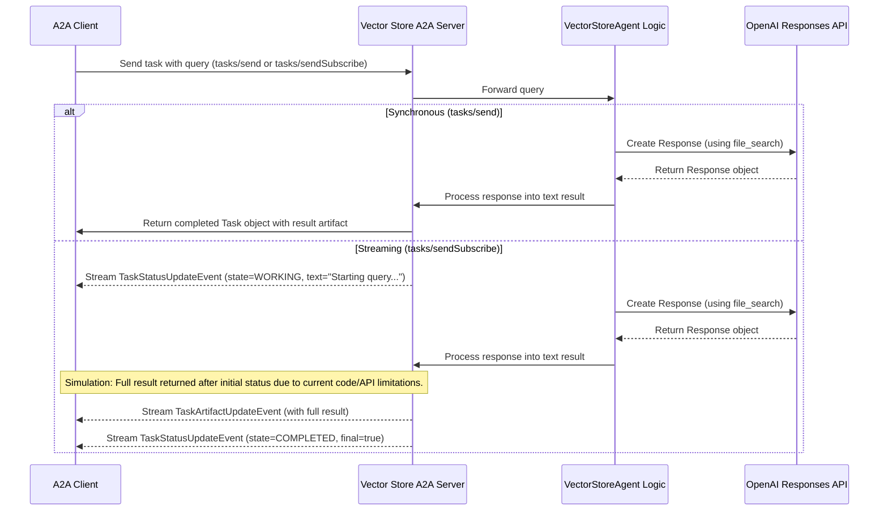

# Vector Store Knowledge Agent

A general-purpose A2A agent that provides information from an OpenAI vector store using the Responses API.

## Overview

The Vector Store Knowledge Agent is an A2A (Agent-to-Agent) compliant agent that enables querying and retrieving information from any OpenAI vector store. This agent is designed to be versatile and configurable, allowing it to work with different vector stores containing various types of knowledge, from documentation to specialized domain information.

## Features

- **OpenAI Vector Store Integration**: Connect to any OpenAI vector store by simply providing the vector store ID
- **Streaming Support**: Stream responses in real-time for a better user experience
- **Configurable**: Customize the model, maximum results, and prompt template to fit your needs
- **Mock Mode**: Automatically falls back to mock responses when no vector store is available
- **A2A Protocol Compatibility**: Fully compatible with the A2A protocol for seamless integration with other agents

## How It Works

This agent uses OpenAI's Responses API with the `file_search` tool to query a specified vector store.



## Prerequisites

- Python 3.13 or higher
- OpenAI API key with access to the Responses API and vector stores
- A2A framework

## Setup & Running

### Running the Server

The easiest way to run the agent is using the provided entry point:

```bash
# Set your OpenAI API key and vector store ID
export OPENAI_API_KEY=your-openai-api-key
export VECTOR_STORE_ID=your-vector-store-id

# Navigate to the agent directory
cd samples/python/agents/vector_store_agent

# Run the server
uv run .

# Optionally specify host and port
# uv run . --host 0.0.0.0 --port 8080
```

This will start an A2A server on localhost port 10050 (or your specified port).

### Querying the Agent

Once the server is running, you can query it using any A2A-compatible client:

```bash
# Navigate to the CLI directory
cd samples/python/hosts/cli

# Run the CLI client against your agent
uv run . --agent http://localhost:10050
```

## Configuration

The agent can be configured through environment variables:

| Environment Variable | Description | Default |
|----------------------|-------------|---------|
| `OPENAI_API_KEY` | Your OpenAI API key | Required |
| `VECTOR_STORE_ID` | The ID of your OpenAI vector store | Required for non-mock mode |
| `VECTOR_STORE_MODEL` | The OpenAI model to use | `gpt-4.1-mini` |
| `VECTOR_STORE_HOST` | The host to run the A2A server on | `localhost` |
| `VECTOR_STORE_PORT` | The port to run the A2A server on | `10050` |
| `VECTOR_STORE_MAX_RESULTS` | Maximum number of results to return | `5` |
| `VECTOR_STORE_ENABLE_STREAMING` | Enable/disable streaming responses | `true` |
| `VECTOR_STORE_CHUNK_SIZE` | Character size of streaming chunks | `20` |

## Creating a Vector Store

To use this agent effectively, you need to create an OpenAI vector store:

1. Prepare your documents for ingestion into a vector store
2. Use OpenAI's API to create a vector store with your documents
3. Obtain the vector store ID
4. Configure the agent with your vector store ID

For detailed instructions on vector store searching with the file_search tool, refer to the [OpenAI documentation](https://platform.openai.com/docs/guides/tools-file-search).

## Customizing the Agent

### Prompt Template

You can customize the prompt template by modifying the `DEFAULT_MODEL_PROMPT` in the `config.py` file. The prompt template should include a `{query}` placeholder that will be replaced with the user's query.

### Adding Custom Functionality

The agent is designed to be extensible. To add custom functionality:

1. Modify the `VectorStoreAgent` class in `agent.py`
2. Add your custom logic to the `process_query` and `stream_query` methods
3. Update the configuration as needed

## License

This project is licensed under the terms of the Apache 2.0 license - see the LICENSE file for details.

## Contributing

Contributions are welcome! Please feel free to submit a Pull Request.