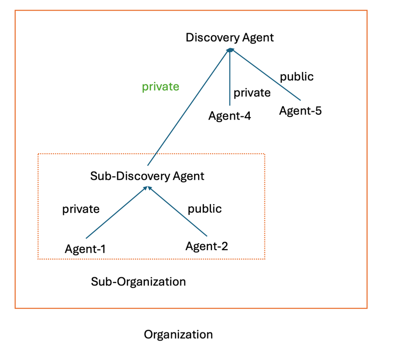
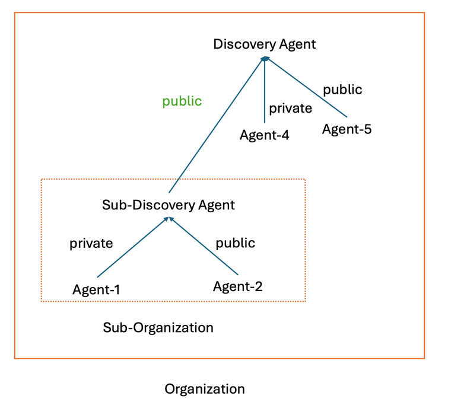

# Discovering Agent (Card)s

<!-- TOC -->

- [Discovering Agent Cards](#discovering-agent-cards)
  - [Open Discovery](#open-discovery)
  - [Curated Discovery (Registry-Based)](#curated-discovery-registry-based)
  - [Private Discovery (API-Based)](#private-discovery-api-based)
  - [Securing Agent Cards](#securing-agent-cards)

<!-- /TOC -->

A2A's [AgentCard](/documentation.md#agent-card) standardizes the *format* of the data shared during discovery. However there are unlimited ways to discover these agent cards. We anticipate this being an open topic for discussion and look forward to ideas from the community.

Here is our current thinking. 

## Open Discovery
We recommend enterprises host their agent cards at a well-known path. Specifically: https://`DOMAIN`/.well-known/agent.json. Clients will use DNS to resolve a known or found domain, send a simple `GET` request to the path, and receive the agent card. 

This will enable web-crawlers and applications to easily discover agents for known or configured domains. This effectively reduces the discovery process to "find a domain". 

## Curated Discovery (Registry-Based)
We anticipate enterprise applications making curated registries of agents available through a catalog interface. This opens up more enterprise scenarios such as organization-specific agent registries that are curated by an administrator. 


我们提议设计一个在组织范围内全局唯一的 Discovery Agent，用来提供 Registry-Based 的 Agent 服务发现能力。
Discovery Agent 包括以下必须的能力：
- Agent Registry：负责 Agent 的注册，反注册和更新注册信息，例如能够回答 "注册我的代理，其具备以下功能：..."
- Agent Discovery：基于各种标准和能力发现已经注册的合适的 Agent，例如能够回答 "寻找能够处理 pfd 文档的 agent"。

其中的 Agent Registry 能力只有具备 registry 相关认证权限能够使用成功。
已经注册到 Discovery Agent 的 Agent 根据其注册选择的可见性，可以被组织内或组织外的 Agent 发现。

Discovery Agent 也可以提供一些可选的能力：
- Registry Analytics：提供关于已注册的 Agent 的分析和见解，例如能够回答 "哪个 agent 的评分最高？" 。

### agent 的可见性

Agent 的可见性是通过 Agent 注册到 Discovery Agent 的方式决定的。
Agent 可以选择 private 或者 public 的方式注册到 Discovery Agent 中，默认采用 public 的方式注册。


注册到同一个 Discovery Agent 中的 agent 处于同一个组织。

| Agent 的注册方式 | 是否可以被同组织内的其他 Agent 发现 | 是否可以被组织外的 Agent 发现 |
|-------------|-----------------------|--------------------|
| private     | Yes                   | No                 |
| public      | Yes                   | Yes                |

在使用Discovery Agent API进行Agent注册和更新时，必须明确指定`visibility`字段来控制Agent的可见性。这个字段有两个可选值：
- `private`: 只对同组织内的其他Agent可见
- `public`: 对组织内和组织外的Agent都可见

如果注册或更新时未提供`visibility`字段，Discovery Agent将默认使用`public`可见性。可见性设置会影响Agent在跨组织搜索中的发现能力，特别是在组织层次结构中尤为重要。

### agent 的组织层次

agent 的组织层次可以通过 Discovery Agent 的注册来实现。 

Sub-Discovery Agent 可以同样地可以采用 private 或者 public 的方式注册更上层的 Discovery Agent 中。
下图展示了 Sub-Organization 中的 Sub-Discovery Agent 采用 *private* 方式注册到 Discovery Agent 形成更大的 Organization。

如果 Organization 外的 Agent 只知道  Discovery Agent 的话，则其只能发现 Agent-5，无法发现 Agent-4 和 Sub-Discovery Agent，从而也无法通过 Sub-Discovery Agent 发现 Agent-1 和 Agent-2。




下图展示了 Sub-Organization 中的 Sub-Discovery Agent 采用 *public* 方式注册到 Discovery Agent 形成更大的Organization 。
如果 Organization 外的 Agent 只知道  Discovery Agent 的话，则其能发现 Agent-5 和 Sub-Discovery Agent，从而能通过 Sub-Discovery Agent 发现 Agent-2，但是无法发现 Agent-1 和 Agent-4。



### Discovery Agent 的 Agent Card

Discovery Agent 的 Agent Card 可以描述为：

```json
{
  "name": "Discovery Agent",
  "description": "A specialized agent that provides registry-based discovery services for A2A agents. It maintains a catalog of registered agents and helps clients find the most suitable agents for their tasks based on capabilities and requirements.",
  "url": "https://discovery-agent.google.com",
  "provider": {
    "organization": "Google",
    "url": https://google.com"
  },
  "version": "1.0.0",
  "documentationUrl": "https://discovery-agent.google.com/docs",
  "capabilities": {
    "streaming": true,
    "pushNotifications": true,
    "stateTransitionHistory": true
  },
  "authentication": {
    "schemes": ["OAuth2"]
  },
  "defaultInputModes": ["text/plain", "application/json"],
  "defaultOutputModes": ["text/plain", "application/json"],
  "skills": [
    {
      "id": "agent-registry",
      "name": "Agent Registry",
      "description": "Manages the registry of A2A agents with CRUD operations for agent registration",
      "tags": ["registry", "management", "administration"],
      "examples": [
        "Register my agent with the following capabilities...",
        "Update my agent's information",
        "Remove my agent from the registry"
      ],
      "inputModes": ["application/json"],
      "outputModes": ["application/json"]
    },
    {
      "id": "agent-discovery",
      "name": "Agent Discovery",
      "description": "Discovers agents that match specific criteria or capabilities",
      "tags": ["discovery", "search", "find"],
      "examples": [
        "Find agents that can process PDF documents",
        "Which agents support video analysis?",
        "Find an agent that can translate from Chinese to English",
        "List all available financial reporting agents"
      ],
      "inputModes": ["text/plain", "application/json"],
      "outputModes": ["application/json"]
    },
    {
      "id": "registry-analytics",
      "name": "Registry Analytics",
      "description": "Provides analytics and insights about registered agents",
      "tags": ["analytics", "statistics", "reporting"],
      "examples": [
        "What are the most popular agent categories?",
        "Generate a report of agent usage statistics",
        "Which agents have the highest rating?"
      ],
      "inputModes": ["text/plain"],
      "outputModes": ["application/json", "text/html"]
    },
  ]
}
```

### 其他 Agent 和 Discovery Agent 的交互流程

下面通过 SendTask 来展示其他 Agent 和 Discovery Agent 的交互流程：

```json
/ 1. Agent Registration Request (with Registry Authentication)
// Request
{
  "jsonrpc": "2.0",
  "id": 1,
  "method": "tasks/send",
  "params": {
    "id": "reg-task-123456",
    "message": {
      "role": "user",
      "parts": [
        {
          "type": "text",
          "text": "Register my agent"
        },
        {
          "type": "data",
          "data": {
            "operation": "register",
            "registryAuth": {
              "authId": "registry-user-789012",
              "authToken": "eyJhbGciOiJSUzI1NiIsInR5cCI6IkpXVCJ9...",
              "permissions": ["registry:write", "agent:register"]
            },
            "organizationId": "org-fintech-123",
            "visibility": "private",
            "agentCard": {
              "name": "Finance Reports Agent",
              "description": "An agent specialized in generating financial reports and analysis",
              "url": "https://finance-agent.example.com",
              "provider": {
                "organization": "FinTech Solutions",
                "url": "https://fintechsolutions.example.com"
              },
              "version": "1.0.0",
              "capabilities": {
                "streaming": true,
                "pushNotifications": false
              },
              "authentication": {
                "schemes": ["OAuth2", "ApiKey"]
              },
              "defaultInputModes": ["text/plain", "application/json"],
              "defaultOutputModes": ["text/plain", "application/json", "application/pdf"],
              "skills": [
                {
                  "id": "financial-analysis",
                  "name": "Financial Analysis",
                  "description": "Analyzes financial data and generates insights",
                  "tags": ["finance", "analysis", "reporting"],
                  "examples": [
                    "Generate a quarterly financial report",
                    "Analyze our cash flow trends"
                  ]
                },
                {
                  "id": "budget-forecasting",
                  "name": "Budget Forecasting",
                  "description": "Creates budget forecasts based on historical data",
                  "tags": ["budget", "forecast", "planning"],
                  "examples": [
                    "Create a budget forecast for next year",
                    "Predict our expenses for Q3"
                  ]
                }
              ]
            },
            "metadata": {
              "tags": ["finance", "enterprise", "reporting"],
              "category": "business",
              "subCategory": "finance"
            },
          }
        }
      ]
    }
  }
}

// 2. Discovery Agent Response (Success - Registry Authentication)
// Response
{
  "jsonrpc": "2.0",
  "id": 1,
  "result": {
    "id": "reg-task-123456",
    "sessionId": "session-789012",
    "status": {
      "state": "completed",
      "timestamp": "2023-09-15T14:28:32.415Z"
    },
    "artifacts": [
      {
        "name": "registration-result",
        "parts": [
          {
            "type": "data",
            "data": {
              "registrationStatus": "success",
              "registryId": "agent-fin-345678",
              "organizationId": "org-fintech-123",
              "registrationTimestamp": "2023-09-15T14:28:31.982Z",
              "authId": "registry-user-789012",
              "visibility": "private",
              "message": "Your agent has been successfully registered with the A2A Registry."
            }
          },
          {
            "type": "text",
            "text": "Your Finance Reports Agent has been successfully registered with the A2A Registry. Registry ID: agent-fin-345678."
          }
        ]
      }
    ]
  }
}

// 3. Registration Request (Failed - No Registry Authentication)
// Request
{
  "jsonrpc": "2.0",
  "id": 2,
  "method": "tasks/send",
  "params": {
    "id": "failed-reg-task-234567",
    "message": {
      "role": "user",
      "parts": [
        {
          "type": "text",
          "text": "Register my agent"
        },
        {
          "type": "data",
          "data": {
            "operation": "register",
            "agentCard": {
              "name": "Data Analysis Agent",
              "description": "An agent for data analysis and visualization",
              "url": "https://data-agent.example.com",
              "provider": {
                "organization": "Data Insights LLC",
                "url": "https://datainsights.example.com"
              },
              "version": "1.0.0"
              // Rest of agent card...
            }
          }
        }
      ]
    }
  }
}

// 4. Discovery Agent Response (Failed - Registry Authentication Required)
// Response
{
  "jsonrpc": "2.0",
  "id": 2,
  "error": {
    "code": -32401,
    "message": "Registry authentication required",
    "data": {
      "operation": "register",
      "requiredPermissions": ["registry:write", "agent:register"],
      "authenticationSchemes": ["OAuth2"],
      "authenticationEndpoint": "https://discovery-agent.example.com/auth"
    }
  }
}

// 5. Update Agent Information (with Registry Authentication)
// Request
{
  "jsonrpc": "2.0",
  "id": 3,
  "method": "tasks/send",
  "params": {
    "id": "update-task-345678",
    "message": {
      "role": "user",
      "parts": [
        {
          "type": "text",
          "text": "Update my agent information"
        },
        {
          "type": "data",
          "data": {
            "operation": "update",
            "registryId": "agent-fin-345678",
            "organizationId": "org-fintech-123",
            "registryAuth": {
              "authId": "registry-user-789012",
              "authToken": "eyJhbGciOiJSUzI1NiIsInR5cCI6IkpXVCJ9...",
              "permissions": ["registry:write", "agent:update"]
            },
            "updates": {
              "agentCard": {
                "version": "1.1.0",
                "description": "A comprehensive agent specialized in generating financial reports, analysis and investment recommendations",
                "skills": [
                  {
                    "id": "investment-advisor",
                    "name": "Investment Advisor",
                    "description": "Provides investment recommendations based on financial data",
                    "tags": ["investment", "advisor", "recommendations"],
                    "examples": [
                      "Recommend investment strategies for my portfolio",
                      "Analyze market trends and suggest investments"
                    ]
                  }
                ]
              },
              "visibility": "public",
              "metadata": {
                "tags": ["finance", "enterprise", "reporting", "investment"]
              }
            }
          }
        }
      ]
    }
  }
}

// 6. Discovery Agent Update Response (Success - Registry Authentication)
// Response
{
  "jsonrpc": "2.0",
  "id": 3,
  "result": {
    "id": "update-task-345678",
    "sessionId": "session-456789",
    "status": {
      "state": "completed",
      "timestamp": "2023-09-15T15:36:45.712Z"
    },
    "artifacts": [
      {
        "name": "update-result",
        "parts": [
          {
            "type": "data",
            "data": {
              "updateStatus": "success",
              "registryId": "agent-fin-345678",
              "organizationId": "org-fintech-123",
              "updateTimestamp": "2023-09-15T15:36:44.521Z",
              "authId": "registry-user-789012",
              "visibility": "public",
              "message": "Your agent information has been successfully updated."
            }
          },
          {
            "type": "text",
            "text": "Your Finance Reports Agent (ID: agent-fin-345678) information has been successfully updated. Version updated to 1.1.0 and added new skill 'Investment Advisor'."
          }
        ]
      }
    ]
  }
}

// 7. Agent Discovery Request (No Registry Authentication Required)
// Request
{
  "jsonrpc": "2.0",
  "id": 4,
  "method": "tasks/send",
  "params": {
    "id": "discovery-task-456789",
    "message": {
      "role": "user",
      "parts": [
        {
          "type": "text",
          "text": "Find agents that can process PDF documents"
        }
      ]
    }
  }
}

// 8. Discovery Agent Response (Discovery operations don't require registry auth)
// Response
{
  "jsonrpc": "2.0",
  "id": 4,
  "result": {
    "id": "discovery-task-456789",
    "sessionId": "session-567890",
    "status": {
      "state": "completed",
      "timestamp": "2023-09-15T16:12:22.891Z"
    },
    "artifacts": [
      {
        "name": "discovery-results",
        "parts": [
          {
            "type": "data",
            "data": {
              "matches": [
                {
                  "registryId": "agent-doc-123456",
                  "agentCard": {
                    "name": "Document Processing Agent",
                    "description": "An agent specialized in processing and analyzing various document formats",
                    "url": "https://doc-agent.example.com",
                    "provider": {
                      "organization": "DocTech Solutions",
                      "url": "https://doctech.example.com"
                    },
                    "version": "2.0.0",
                    "capabilities": {
                      "streaming": true,
                      "pushNotifications": true
                    },
                    "defaultInputModes": ["application/pdf", "image/jpeg", "image/png", "text/plain"],
                    "defaultOutputModes": ["text/plain", "application/json", "application/pdf"]
                  },
                  "organizationId": "org-doctech-456",
                  "visibility": "public",
                  "matchScore": 0.95,
                  "matchReason": "Explicit support for PDF processing in input modes"
                },
                // Second result omitted for brevity
              ],
              "totalMatches": 2,
              "searchCriteria": {
                "capability": "PDF processing"
              }
            }
          },
          {
            "type": "text",
            "text": "I found 2 agents that can process PDF documents:\n\n1. Document Processing Agent (DocTech Solutions) - An agent specialized in processing and analyzing various document formats, with full PDF input support\n\n2. Content Analysis AI (AI Research Group) - AI agent for analyzing and extracting information from various content types, including PDF documents"
          }
        ]
      }
    ]
  }
}

// 9. Registry Analytics Request (No Registry Authentication Required)
// Request
{
  "jsonrpc": "2.0",
  "id": 5,
  "method": "tasks/send",
  "params": {
    "id": "analytics-task-567890",
    "message": {
      "role": "user",
      "parts": [
        {
          "type": "text",
          "text": "Which agent categories are most popular?"
        }
      ]
    }
  }
}

// 10. Discovery Agent Analytics Response
// Response
{
  "jsonrpc": "2.0",
  "id": 5,
  "result": {
    "id": "analytics-task-567890",
    "sessionId": "session-678901",
    "status": {
      "state": "completed",
      "timestamp": "2023-09-15T16:28:53.476Z"
    },
    "artifacts": [
      {
        "name": "analytics-results",
        "parts": [
          {
            "type": "data",
            "data": {
              "popularCategories": [
                {
                  "category": "productivity",
                  "agentCount": 28,
                  "totalUsage": 15784,
                  "averageRating": 4.6
                },
                // Other categories omitted for brevity
              ],
              "analysisTimestamp": "2023-09-15T16:28:52.123Z",
              "totalAgents": 146
            }
          },
          {
            "type": "text",
            "text": "Based on the current 146 registered agents, the most popular categories are:\n\n1. Productivity - 28 agents, 15,784 total uses, 4.6 average rating\n2. Document Processing - 15 agents, 12,365 total uses, 4.4 average rating\n3. Business - 22 agents, 10,932 total uses, 4.2 average rating\n4. Communication - 18 agents, 9,845 total uses, 4.3 average rating\n5. Creative - 12 agents, 7,623 total uses, 4.5 average rating"
          }
        ]
      }
    ]
  }
}

// 11. Agent Deregistration Request (with Registry Authentication)
// Request
{
  "jsonrpc": "2.0",
  "id": 6,
  "method": "tasks/send",
  "params": {
    "id": "deregister-task-678901",
    "message": {
      "role": "user",
      "parts": [
        {
          "type": "text",
          "text": "Remove my agent from the registry"
        },
        {
          "type": "data",
          "data": {
            "operation": "deregister",
            "registryId": "agent-fin-345678",
            "organizationId": "org-fintech-123",
            "registryAuth": {
              "authId": "registry-user-789012",
              "authToken": "eyJhbGciOiJSUzI1NiIsInR5cCI6IkpXVCJ9...",
              "permissions": ["registry:write", "agent:register"]
            }
          }
        }
      ]
    }
  }
}

// 12. Discovery Agent Deregistration Response (Success - Registry Authenticated)
// Response
{
  "jsonrpc": "2.0",
  "id": 6,
  "result": {
    "id": "deregister-task-678901",
    "sessionId": "session-789012",
    "status": {
      "state": "completed",
      "timestamp": "2023-09-15T17:05:18.913Z"
    },
    "artifacts": [
      {
        "name": "deregistration-result",
        "parts": [
          {
            "type": "data",
            "data": {
              "deregistrationStatus": "success",
              "registryId": "agent-fin-345678",
              "organizationId": "org-fintech-123",
              "deregistrationTimestamp": "2023-09-15T17:05:17.842Z",
              "authId": "registry-user-789012",
              "message": "Your agent has been successfully removed from the registry."
            }
          },
          {
            "type": "text",
            "text": "Your Finance Reports Agent (ID: agent-fin-345678) has been successfully removed from the A2A Registry."
          }
        ]
      }
    ]
  }
}
```
*We **are** considering adding Registry support to the protocol - please drop us a [note](https://github.com/google/A2A/blob/main/README.md#contributing) with your opinion and where you see this being valuable as a standard*

## Private Discovery (API-Based)
There will undoubtably be private "agent stores" or proprietary agents where cards are exchanged behind custom APIs.

*We **are not** considering private discovery APIs as an A2A concern - please drop us a [note](https://github.com/google/A2A/blob/main/README.md#contributing) with your opinion and where you see this being valuable as a standard*

## Securing Agent Cards

Agent cards may contain sensitive information. Implementors may decide to secure their agent cards behind controls that require authentication and authorization. For example, within an organization, even an open discovery at a well-known path could be guarded by mTLS and restricted to specific clients. Registries and Private Discovery APIs should require authentication and return different artifacts for different identities. 

Note that implementors may include credential information (such as API Keys) in their Agent Cards. It is recommended that this information is NEVER available without Authentication. 
