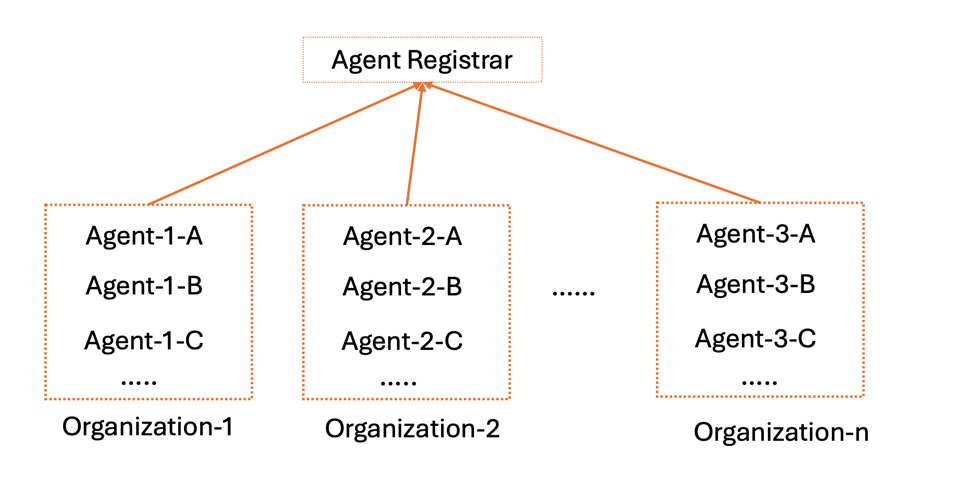

# Discovering Agent (Card)s

<!-- TOC -->

- [Discovering Agent Cards](#discovering-agent-cards)
  - [Open Discovery](#open-discovery)
  - [Curated Discovery (Registry-Based)](#curated-discovery-registry-based)
  - [Private Discovery (API-Based)](#private-discovery-api-based)
  - [Securing Agent Cards](#securing-agent-cards)

<!-- /TOC -->

A2A's [AgentCard](/documentation.md#agent-card) standardizes the *format* of the data shared during discovery. However there are unlimited ways to discover these agent cards. We anticipate this being an open topic for discussion and look forward to ideas from the community.

Here is our current thinking. 

## Open Discovery
We recommend enterprises host their agent cards at a well-known path. Specifically: https://`DOMAIN`/.well-known/agent.json. Clients will use DNS to resolve a known or found domain, send a simple `GET` request to the path, and receive the agent card. 

This will enable web-crawlers and applications to easily discover agents for known or configured domains. This effectively reduces the discovery process to "find a domain". 

## Curated Discovery (Registry-Based)
We anticipate enterprise applications making curated registries of agents available through a catalog interface. This opens up more enterprise scenarios such as organization-specific agent registries that are curated by an administrator. 


We recommend designing a globally unique Agent Registrar to uniformly manage Agents under various organizations, providing Registry-Based Agent service discovery capabilities.

Organizations can manage their own Agents, and each Agent must belong to exactly one organization.
Agent Registrar includes the following required capabilities:
- Organization Management: Responsible for organization registration, updating, and deletion, such as being able to answer "Create a new organization".
- Agent Registry: Responsible for Agent registration, deregistration, and updating registration information, such as being able to answer "Register my agent with the following capabilities: ...".
- Agent Discovery: Discovering suitable registered Agents based on various standards and capabilities, such as being able to answer "Find an agent that can process PDF documents".



Agent Registrar can also provide some optional capabilities:
- Registry Analytics: Provides analysis and insights about registered Agents, such as being able to answer "Which agent has the highest rating?".

### Organization Management

Organizations need to register with the Agent Registrar, and the Agent Registrar will assign a unique `organizationID` to each organization.

###  Agent Registry 

#### Agent Visibility
Agent visibility refers to whether the Agent can be discovered by other Agents within or outside the organization. The way an Agent registers with the Agent Registrar affects its visibility.

Agents can choose to register with the Agent Registrar in either a private or public way, with public registration being the default.

| Agent Registration Method | Can be discovered by other Agents within the organization | Can be discovered by Agents outside the organization |
|-------------|----------------------|--------------------|
| private     | Yes                  | No                 |
| public      | Yes                  | Yes                |

Agents control their visibility by explicitly specifying the `organizationID` and `visibility` fields.
All interactions with the Agent Registrar need to include the `organizationID` field to indicate which Organization the Agent belongs to. Each Agent can have one and only one `organizationID`.

When using the Agent Registrar for Agent registration and updates, use the `visibility` field, which has two possible values:
- `private`: Visible only to other Agents within the same organization
- `public`: Visible to Agents both within and outside the organization

#### Authentication and Authorization

When registering with the Agent Registrar, Agents need to have credentials distributed by the organization (such as an `organizationToken`) for authentication.


### Agent Implementation of the Agent Registrar

The Agent Registrar can be implemented as an Agent, with its Agent Card described as:

```json
{
  "name": "Agent Registrar ",
  "description": "A specialized agent that provides registry-based discovery services for A2A agents. It maintains a catalog of registered agents and helps clients find the most suitable agents for their tasks based on capabilities and requirements.",
  "url": "https://discovery-agent.google.com",
  "provider": {
    "organization": "Google",
    "url": https://google.com"
  },
  "version": "1.0.0",
  "documentationUrl": "https://discovery-agent.google.com/docs",
  "capabilities": {
    "streaming": true,
    "pushNotifications": true,
    "stateTransitionHistory": true
  },
  "authentication": {
    "schemes": ["OAuth2"]
  },
  "defaultInputModes": ["text/plain", "application/json"],
  "defaultOutputModes": ["application/json", "text/html"],
  "skills": [
    {
      "id": "organization-management",
      "name": "Organization Management",
      "description": "Manages organizations within the organization with CRUD operations for organization administration",
      "tags": ["organization", "management", "administration", "organization"],
      "examples": [
        "Create a new organization for my organization",
        "Update our organization information",
        "Delete our existing organization",
        "List all organizations in our organization",
        "Retrieve our organization's details and token"
      ],
      "inputModes": ["application/json", "text/plain"],
      "outputModes": ["application/json"]
    },
    {
      "id": "agent-registry",
      "name": "Agent Registry",
      "description": "Manages the registry of A2A agents with CRUD operations for agent registration",
      "tags": ["registry", "management", "administration"],
      "examples": [
        "Register my agent with the following capabilities...",
        "Update my agent's information",
        "Remove my agent from the registry"
      ],
      "inputModes": ["application/json"],
      "outputModes": ["application/json"]
    },
    {
      "id": "agent-discovery",
      "name": "Agent Discovery",
      "description": "Discovers agents that match specific criteria or capabilities",
      "tags": ["discovery", "search", "find"],
      "examples": [
        "Find agents that can process PDF documents",
        "Which agents support video analysis?",
        "Find an agent that can translate from Chinese to English",
        "List all available financial reporting agents"
      ],
      "inputModes": ["text/plain", "application/json"],
      "outputModes": ["application/json"]
    },
    {
      "id": "registry-analytics",
      "name": "Registry Analytics",
      "description": "Provides analytics and insights about registered agents",
      "tags": ["analytics", "statistics", "reporting"],
      "examples": [
        "What are the most popular agent categories?",
        "Generate a report of agent usage statistics",
        "Which agents have the highest rating?"
      ],
      "inputModes": ["text/plain"],
      "outputModes": ["application/json", "text/html"]
    },
  ]
}
```

#### Interaction Flow Between Other Agents and the Agent Registrar

The following demonstrates the interaction flow between other Agents and the Agent Registrar using SendTask:

```json
// 1. Organization Registration Request
// Request
{
  "jsonrpc": "2.0",
  "id": 1,
  "method": "tasks/send",
  "params": {
    "id": "organization-reg-task-123456",
    "message": {
      "role": "user",
      "parts": [
        {
          "type": "text",
          "text": "Create a new organization"
        },
        {
          "type": "data",
          "data": {
            "operation": "registerOrganization",
            "organizationInfo": {
              "name": "FinTech Solutions Organization",
              "description": "Financial technology solutions development organization",
              "contact": "organization-lead@fintechsolutions.example.com"
            }
          }
        }
      ]
    }
  }
}

// 2. Agent Registrar Response (Organization Registration Success)
// Response
{
  "jsonrpc": "2.0",
  "id": 1,
  "result": {
    "id": "organization-reg-task-123456",
    "sessionId": "session-789012",
    "status": {
      "state": "completed",
      "timestamp": "2023-09-15T13:25:17.328Z"
    },
    "artifacts": [
      {
        "name": "organization-registration-result",
        "parts": [
          {
            "type": "data",
            "data": {
              "registrationStatus": "success",
              "organizationID": "organization-fintech-123",
              "organizationToken": "eyJhbGciOiJIUzI1NiIsInR5cCI6IkpXVCJ9...",
              "registrationTimestamp": "2023-09-15T13:25:16.912Z",
              "message": "Your organization has been successfully registered with the A2A Registry."
            }
          },
          {
            "type": "text",
            "text": "Your organization 'FinTech Solutions Organization' has been successfully registered. Your Organization ID is: organization-fintech-123. Please securely store your organizationToken as it will be required for all organization operations and agent registrations."
          }
        ]
      }
    ]
  }
}

// 3. Organization Update Request
// Request
{
  "jsonrpc": "2.0",
  "id": 2,
  "method": "tasks/send",
  "params": {
    "id": "organization-update-task-234567",
    "message": {
      "role": "user",
      "parts": [
        {
          "type": "text",
          "text": "Update my organization information"
        },
        {
          "type": "data",
          "data": {
            "operation": "updateOrganization",
            "organizationID": "organization-fintech-123",
            "organizationToken": "eyJhbGciOiJIUzI1NiIsInR5cCI6IkpXVCJ9...",
            "updates": {
              "name": "FinTech Enterprise Solutions",
              "description": "Enterprise financial technology solutions and consulting organization",
              "contact": "enterprise-lead@fintechsolutions.example.com"
            }
          }
        }
      ]
    }
  }
}

// 4. Agent Registrar Response (Organization Update Success)
// Response
{
  "jsonrpc": "2.0",
  "id": 2,
  "result": {
    "id": "organization-update-task-234567",
    "sessionId": "session-345678",
    "status": {
      "state": "completed",
      "timestamp": "2023-09-15T14:12:08.541Z"
    },
    "artifacts": [
      {
        "name": "organization-update-result",
        "parts": [
          {
            "type": "data",
            "data": {
              "updateStatus": "success",
              "organizationID": "organization-fintech-123",
              "updateTimestamp": "2023-09-15T14:12:07.823Z",
              "message": "Your organization information has been successfully updated."
            }
          },
          {
            "type": "text",
            "text": "Your organization information has been successfully updated. Organization name changed to 'FinTech Enterprise Solutions'."
          }
        ]
      }
    ]
  }
}

// 5. Agent Registration Request (with Organization Authentication)
// Request
{
  "jsonrpc": "2.0",
  "id": 3,
  "method": "tasks/send",
  "params": {
    "id": "reg-task-123456",
    "message": {
      "role": "user",
      "parts": [
        {
          "type": "text",
          "text": "Register my agent"
        },
        {
          "type": "data",
          "data": {
            "operation": "register",
            "organizationID": "organization-fintech-123",
            "organizationToken": "eyJhbGciOiJSUzI1NiIsInR5cCI6IkpXVCJ9...",
            "visibility": "private",
            "agentCard": {
              "name": "Finance Reports Agent",
              "description": "An agent specialized in generating financial reports and analysis",
              "url": "https://finance-agent.example.com",
              "provider": {
                "organization": "FinTech Solutions",
                "url": "https://fintechsolutions.example.com"
              },
              "version": "1.0.0",
              "capabilities": {
                "streaming": true,
                "pushNotifications": false
              },
              "authentication": {
                "schemes": ["OAuth2", "ApiKey"]
              },
              "defaultInputModes": ["text/plain", "application/json"],
              "defaultOutputModes": ["text/plain", "application/json", "application/pdf"],
              "skills": [
                {
                  "id": "financial-analysis",
                  "name": "Financial Analysis",
                  "description": "Analyzes financial data and generates insights",
                  "tags": ["finance", "analysis", "reporting"],
                  "examples": [
                    "Generate a quarterly financial report",
                    "Analyze our cash flow trends"
                  ]
                },
                {
                  "id": "budget-forecasting",
                  "name": "Budget Forecasting",
                  "description": "Creates budget forecasts based on historical data",
                  "tags": ["budget", "forecast", "planning"],
                  "examples": [
                    "Create a budget forecast for next year",
                    "Predict our expenses for Q3"
                  ]
                }
              ]
            },
            "metadata": {
              "tags": ["finance", "enterprise", "reporting"],
              "category": "business",
              "subCategory": "finance"
            }
          }
        }
      ]
    }
  }
}

// 6. Agent Registrar Response (Success - Organization Authentication)
// Response
{
  "jsonrpc": "2.0",
  "id": 3,
  "result": {
    "id": "reg-task-123456",
    "sessionId": "session-789012",
    "status": {
      "state": "completed",
      "timestamp": "2023-09-15T14:28:32.415Z"
    },
    "artifacts": [
      {
        "name": "registration-result",
        "parts": [
          {
            "type": "data",
            "data": {
              "registrationStatus": "success",
              "registryId": "agent-fin-345678",
              "organizationID": "organization-fintech-123",
              "registrationTimestamp": "2023-09-15T14:28:31.982Z",
              "visibility": "private",
              "message": "Your agent has been successfully registered with the A2A Registry."
            }
          },
          {
            "type": "text",
            "text": "Your Finance Reports Agent has been successfully registered with the A2A Registry. Registry ID: agent-fin-345678."
          }
        ]
      }
    ]
  }
}

// 7. Registration Request (Failed - No Organization Authentication)
// Request
{
  "jsonrpc": "2.0",
  "id": 4,
  "method": "tasks/send",
  "params": {
    "id": "failed-reg-task-234567",
    "message": {
      "role": "user",
      "parts": [
        {
          "type": "text",
          "text": "Register my agent"
        },
        {
          "type": "data",
          "data": {
            "operation": "register",
            "agentCard": {
              "name": "Data Analysis Agent",
              "description": "An agent for data analysis and visualization",
              "url": "https://data-agent.example.com",
              "provider": {
                "organization": "Data Insights LLC",
                "url": "https://datainsights.example.com"
              },
              "version": "1.0.0"
              // Rest of agent card...
            }
          }
        }
      ]
    }
  }
}

// 8. Agent Registrar Response (Failed - Organization Authentication Required)
// Response
{
  "jsonrpc": "2.0",
  "id": 4,
  "error": {
    "code": -32401,
    "message": "Organization authentication required",
    "data": {
      "operation": "register",
      "requiredFields": ["organizationID", "organizationToken"],
      "authenticationEndpoint": "https://agent-registrar.example.com/auth"
    }
  }
}

// 9. Update Agent Information (with Organization Authentication)
// Request
{
  "jsonrpc": "2.0",
  "id": 5,
  "method": "tasks/send",
  "params": {
    "id": "update-task-345678",
    "message": {
      "role": "user",
      "parts": [
        {
          "type": "text",
          "text": "Update my agent information"
        },
        {
          "type": "data",
          "data": {
            "operation": "update",
            "registryId": "agent-fin-345678",
            "organizationID": "organization-fintech-123",
            "organizationToken": "eyJhbGciOiJSUzI1NiIsInR5cCI6IkpXVCJ9...",
            "updates": {
              "agentCard": {
                "version": "1.1.0",
                "description": "A comprehensive agent specialized in generating financial reports, analysis and investment recommendations",
                "skills": [
                  {
                    "id": "investment-advisor",
                    "name": "Investment Advisor",
                    "description": "Provides investment recommendations based on financial data",
                    "tags": ["investment", "advisor", "recommendations"],
                    "examples": [
                      "Recommend investment strategies for my portfolio",
                      "Analyze market trends and suggest investments"
                    ]
                  }
                ]
              },
              "visibility": "public",
              "metadata": {
                "tags": ["finance", "enterprise", "reporting", "investment"]
              }
            }
          }
        }
      ]
    }
  }
}

// 10. Agent Registrar Update Response (Success - Organization Authentication)
// Response
{
  "jsonrpc": "2.0",
  "id": 5,
  "result": {
    "id": "update-task-345678",
    "sessionId": "session-456789",
    "status": {
      "state": "completed",
      "timestamp": "2023-09-15T15:36:45.712Z"
    },
    "artifacts": [
      {
        "name": "update-result",
        "parts": [
          {
            "type": "data",
            "data": {
              "updateStatus": "success",
              "registryId": "agent-fin-345678",
              "organizationID": "organization-fintech-123",
              "updateTimestamp": "2023-09-15T15:36:44.521Z",
              "visibility": "public",
              "message": "Your agent information has been successfully updated."
            }
          },
          {
            "type": "text",
            "text": "Your Finance Reports Agent (ID: agent-fin-345678) information has been successfully updated. Version updated to 1.1.0 and added new skill 'Investment Advisor'."
          }
        ]
      }
    ]
  }
}

// 11. Agent Discovery Request (No Organization Authentication Required for Public Agents)
// Request
{
  "jsonrpc": "2.0",
  "id": 6,
  "method": "tasks/send",
  "params": {
    "id": "discovery-task-456789",
    "message": {
      "role": "user",
      "parts": [
        {
          "type": "text",
          "text": "Find agents that can process PDF documents"
        }
      ]
    }
  }
}

// 12. Agent Registrar Response (Discovery operations of public agents don't require auth)
// Response
{
  "jsonrpc": "2.0",
  "id": 6,
  "result": {
    "id": "discovery-task-456789",
    "sessionId": "session-567890",
    "status": {
      "state": "completed",
      "timestamp": "2023-09-15T16:12:22.891Z"
    },
    "artifacts": [
      {
        "name": "discovery-results",
        "parts": [
          {
            "type": "data",
            "data": {
              "matches": [
                {
                  "registryId": "agent-doc-123456",
                  "agentCard": {
                    "name": "Document Processing Agent",
                    "description": "An agent specialized in processing and analyzing various document formats",
                    "url": "https://doc-agent.example.com",
                    "provider": {
                      "organization": "DocTech Solutions",
                      "url": "https://doctech.example.com"
                    },
                    "version": "2.0.0",
                    "capabilities": {
                      "streaming": true,
                      "pushNotifications": true
                    },
                    "defaultInputModes": ["application/pdf", "image/jpeg", "image/png", "text/plain"],
                    "defaultOutputModes": ["text/plain", "application/json", "application/pdf"]
                  },
                  "organizationID": "organization-doctech-456",
                  "visibility": "public",
                  "matchScore": 0.95,
                  "matchReason": "Explicit support for PDF processing in input modes"
                },
                // Second result omitted for brevity
              ],
              "totalMatches": 2,
              "searchCriteria": {
                "capability": "PDF processing"
              }
            }
          },
          {
            "type": "text",
            "text": "I found 2 agents that can process PDF documents:\n\n1. Document Processing Agent (DocTech Solutions) - An agent specialized in processing and analyzing various document formats, with full PDF input support\n\n2. Content Analysis AI (AI Research Group) - AI agent for analyzing and extracting information from various content types, including PDF documents"
          }
        ]
      }
    ]
  }
}

// 13. Organization-specific Agent Discovery Request (Authenticated - includes private organization agents)
// Request
{
  "jsonrpc": "2.0",
  "id": 7,
  "method": "tasks/send",
  "params": {
    "id": "organization-discovery-task-567890",
    "message": {
      "role": "user",
      "parts": [
        {
          "type": "text",
          "text": "Find all finance agents in my organization"
        },
        {
          "type": "data",
          "data": {
            "operation": "discover",
            "organizationID": "organization-fintech-123",
            "organizationToken": "eyJhbGciOiJSUzI1NiIsInR5cCI6IkpXVCJ9...",
            "searchCriteria": {
              "capability": "finance",
              "includePrivate": true
            }
          }
        }
      ]
    }
  }
}

// 14. Agent Registrar Organization Discovery Response
// Response
{
  "jsonrpc": "2.0",
  "id": 7,
  "result": {
    "id": "organization-discovery-task-567890",
    "sessionId": "session-678901",
    "status": {
      "state": "completed",
      "timestamp": "2023-09-15T16:28:53.476Z"
    },
    "artifacts": [
      {
        "name": "discovery-results",
        "parts": [
          {
            "type": "data",
            "data": {
              "matches": [
                {
                  "registryId": "agent-fin-345678",
                  "agentCard": {
                    "name": "Finance Reports Agent",
                    "description": "A comprehensive agent specialized in generating financial reports, analysis and investment recommendations",
                    // Agent card details omitted for brevity
                  },
                  "organizationID": "organization-fintech-123",
                  "visibility": "public",
                  "matchScore": 0.98,
                  "matchReason": "Direct match for finance capabilities"
                },
                {
                  "registryId": "agent-fin-567890",
                  "agentCard": {
                    "name": "Budget Planning Agent",
                    "description": "Private organization agent for internal budget planning and forecasting",
                    // Agent card details omitted for brevity
                  },
                  "organizationID": "organization-fintech-123",
                  "visibility": "private",
                  "matchScore": 0.92,
                  "matchReason": "Organization-only agent with finance capabilities"
                }
              ],
              "totalMatches": 2,
              "searchCriteria": {
                "capability": "finance",
                "organizationID": "organization-fintech-123",
                "includePrivate": true
              }
            }
          },
          {
            "type": "text",
            "text": "I found 2 finance agents in your organization:\n\n1. Finance Reports Agent - A comprehensive agent for financial reports and investment recommendations (public)\n\n2. Budget Planning Agent - Internal organization agent for budget planning and forecasting (private)"
          }
        ]
      }
    ]
  }
}

// 15. Agent Deregistration Request (with Organization Authentication)
// Request
{
  "jsonrpc": "2.0",
  "id": 8,
  "method": "tasks/send",
  "params": {
    "id": "deregister-task-678901",
    "message": {
      "role": "user",
      "parts": [
        {
          "type": "text",
          "text": "Remove my agent from the registry"
        },
        {
          "type": "data",
          "data": {
            "operation": "deregister",
            "registryId": "agent-fin-345678",
            "organizationID": "organization-fintech-123",
            "organizationToken": "eyJhbGciOiJSUzI1NiIsInR5cCI6IkpXVCJ9..."
          }
        }
      ]
    }
  }
}

// 16. Agent Registrar Deregistration Response (Success - Organization Authenticated)
// Response
{
  "jsonrpc": "2.0",
  "id": 8,
  "result": {
    "id": "deregister-task-678901",
    "sessionId": "session-789012",
    "status": {
      "state": "completed",
      "timestamp": "2023-09-15T17:05:18.913Z"
    },
    "artifacts": [
      {
        "name": "deregistration-result",
        "parts": [
          {
            "type": "data",
            "data": {
              "deregistrationStatus": "success",
              "registryId": "agent-fin-345678",
              "organizationID": "organization-fintech-123",
              "deregistrationTimestamp": "2023-09-15T17:05:17.842Z",
              "message": "Your agent has been successfully removed from the registry."
            }
          },
          {
            "type": "text",
            "text": "Your Finance Reports Agent (ID: agent-fin-345678) has been successfully removed from the A2A Registry."
          }
        ]
      }
    ]
  }
}
```

*We **are** considering adding Registry support to the protocol - please drop us a [note](https://github.com/google/A2A/blob/main/README.md#contributing) with your opinion and where you see this being valuable as a standard*

## Private Discovery (API-Based)
There will undoubtably be private "agent stores" or proprietary agents where cards are exchanged behind custom APIs.

*We **are not** considering private discovery APIs as an A2A concern - please drop us a [note](https://github.com/google/A2A/blob/main/README.md#contributing) with your opinion and where you see this being valuable as a standard*

## Securing Agent Cards

Agent cards may contain sensitive information. Implementors may decide to secure their agent cards behind controls that require authentication and authorization. For example, within an organization, even an open discovery at a well-known path could be guarded by mTLS and restricted to specific clients. Registries and Private Discovery APIs should require authentication and return different artifacts for different identities. 

Note that implementors may include credential information (such as API Keys) in their Agent Cards. It is recommended that this information is NEVER available without Authentication. 
